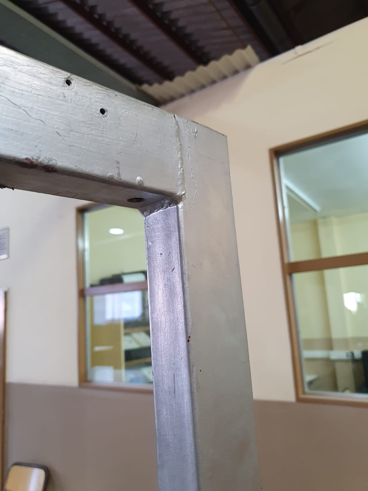
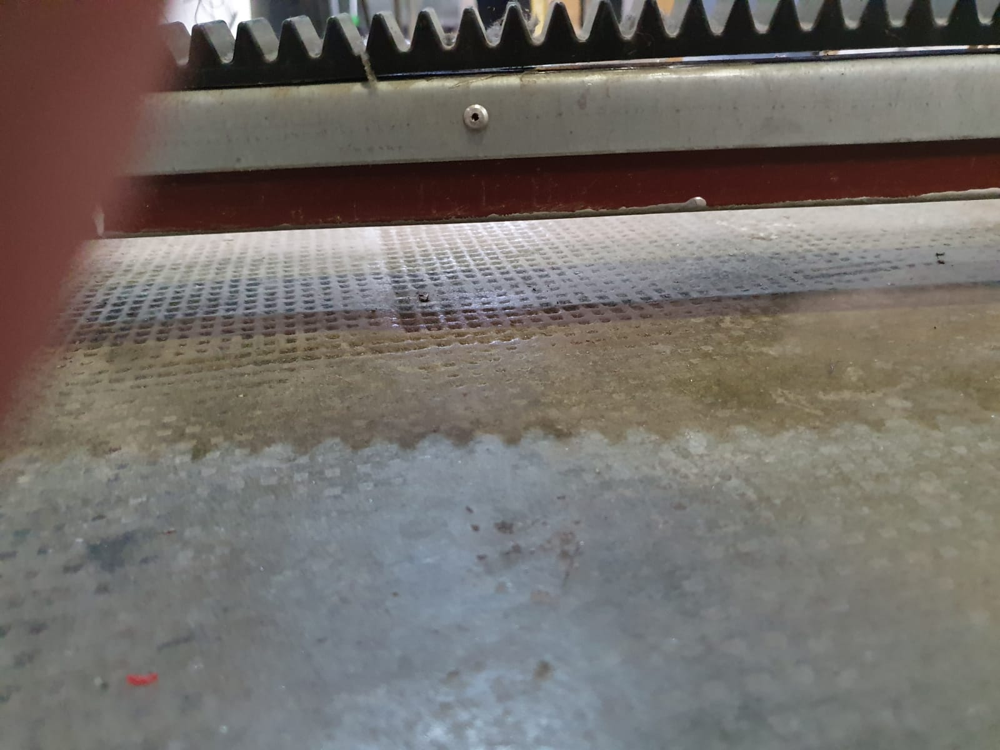
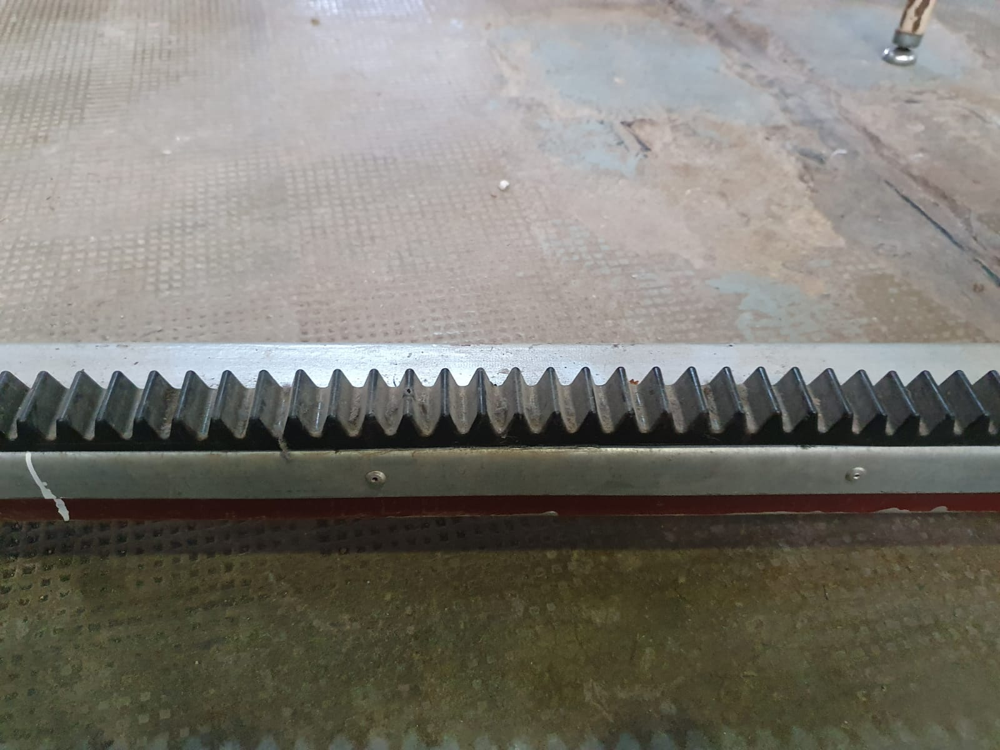
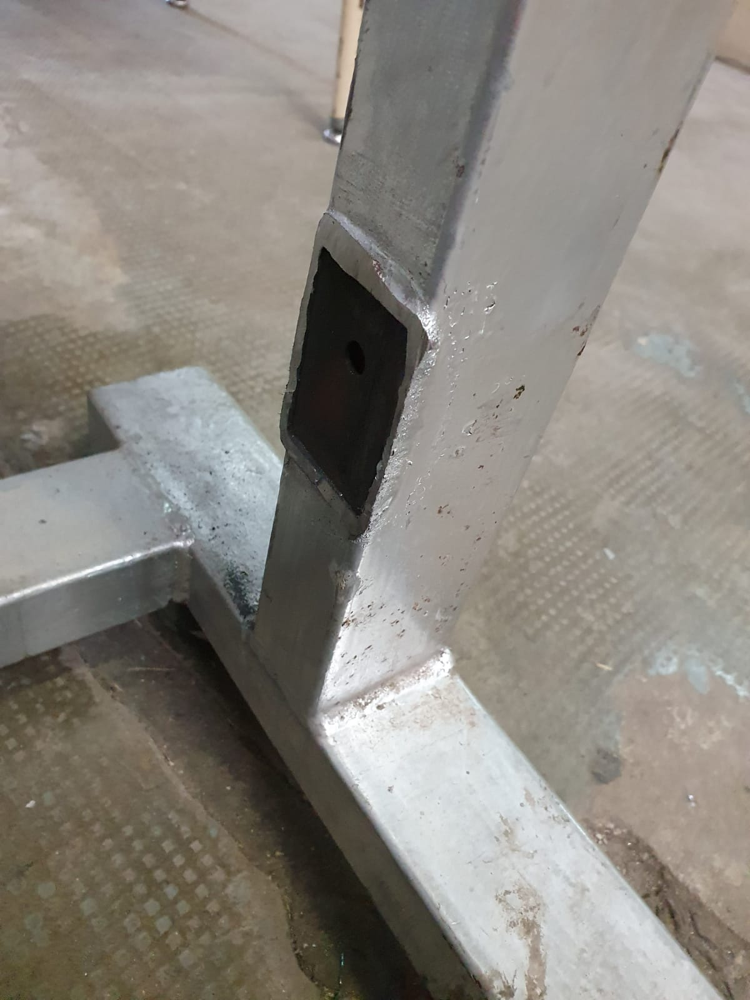

# Construcción de la estructura de la cabina

Los materiales usados para la construccion de la cabina fueron reciclados de proyectos abandonados que habia en la escuela, de uno de ellos sacamos los caños cuadrados de metal de 4x6cm x 3mm de espesor. A continuacion, fotos del mismo

Todo este marco fue cortado utilizando una moladora

